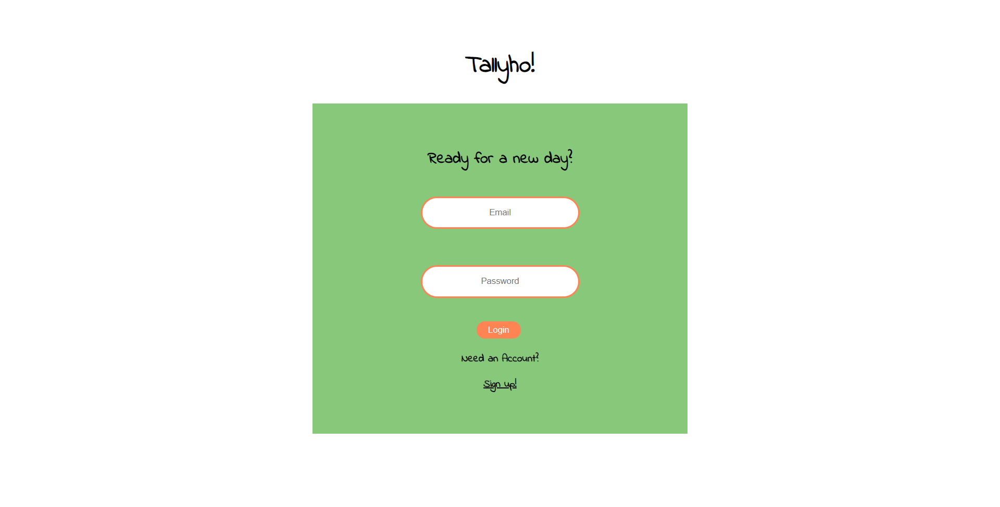
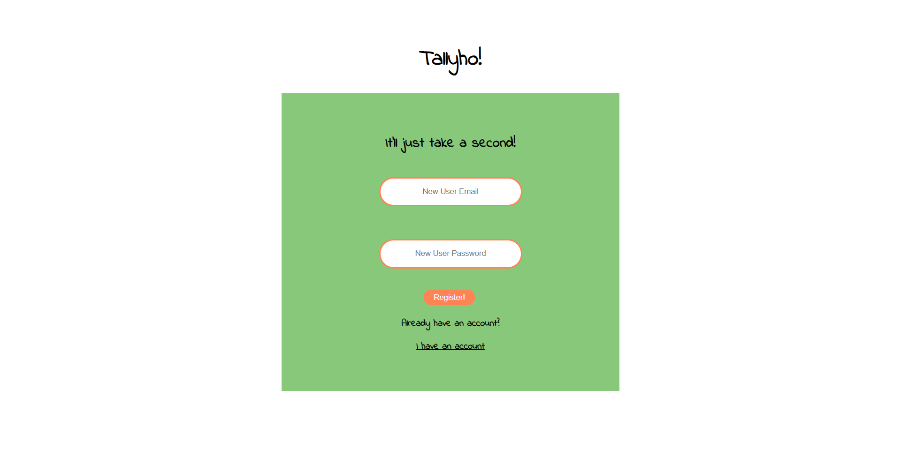
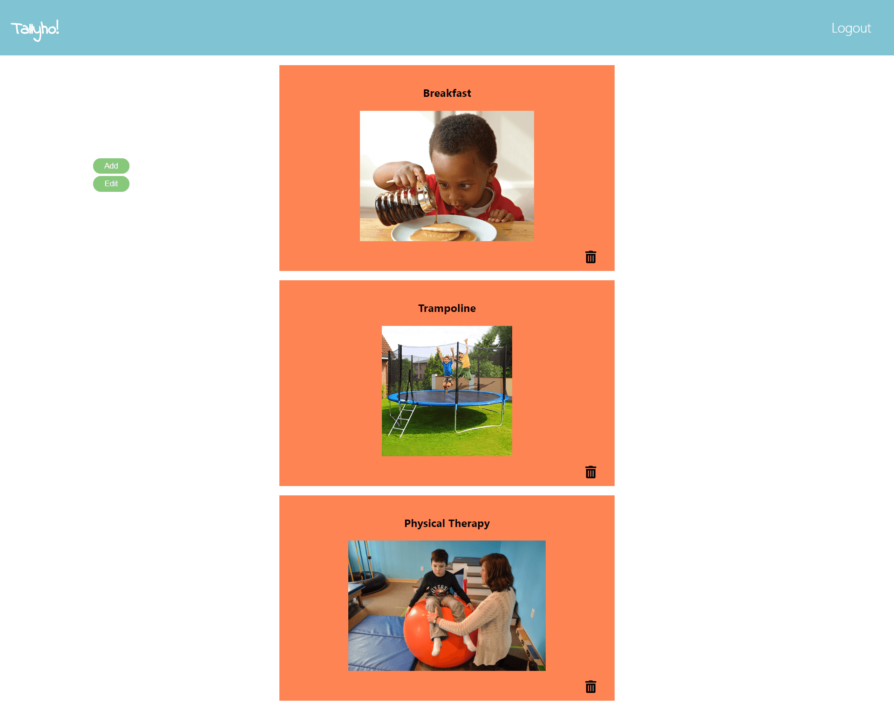
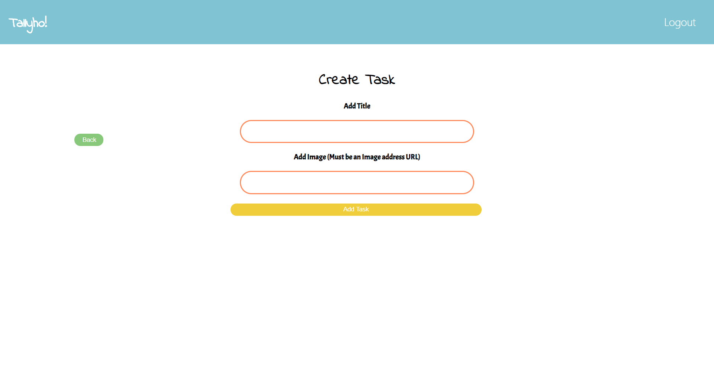
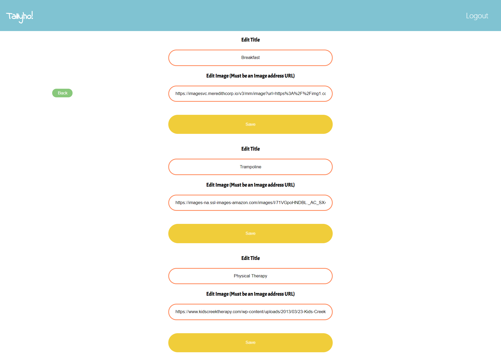

## Tallyho

### What's Tallyho

Tallyho is a visual schedule application where Users can sign up for an account and make a visual schedule to cater to their child's day routine. This minimizes the labor of making a visual schedule or PECS (Picture Exchange Communication System) to use an easy accessible online application.  The User can create multiple tasks to build their schedule as well check off individual tasks when tasks are completed. The User can delete a task of their choosing.  The User can edit and save multiple tasks on the same page. 

>Live demo: https://sophie-tally-ho-app.now.sh

>Server Repo: https://github.com/gjames5355/tallyho-server

### Demo Login:

>Username: test@gmail.com

>Password: !Testing123

### Built on:

> ReactJS, CSS

### Core Features

> Ability to create/login with user accounts

> Ability to create/edit/delete tasks

> Users can check off tasks

## Upcoming features
 > User can click and drag tasks to rearrange the order
 
 > User will be able to upload a personal image from their local computer or have the option to take a picture using their
  mobile device's camera
 
 > After all tasks are checked off, it will show a congratulatory animation for completing the schedule 

## Screenshots

 
